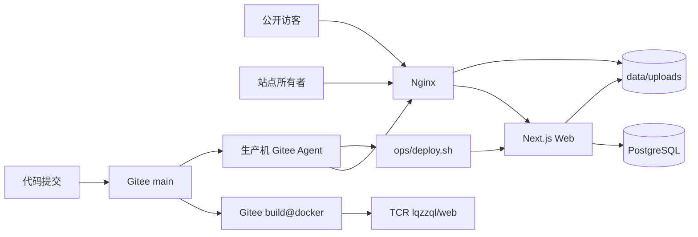
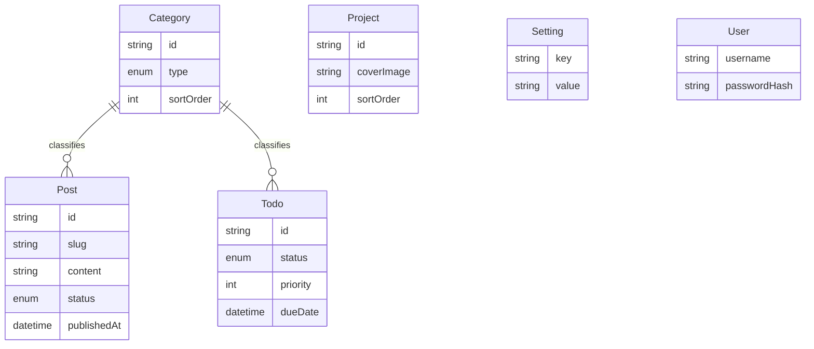

# QZ Site 项目架构与设计说明

> **文档定位**：本文描述当前有效的系统结构、模块边界和关键设计约束，是后续开发理解项目的首要技术文档。最后核对日期为 **2026-08-25**。代码行为、数据模型或部署拓扑变化时，应在同一提交中更新本文。

## 1. 项目目标与范围

QZ Site 是一个面向单一站点所有者的个人网站，当前服务三个实际目标：

1. 用博客沉淀学习笔记和长期知识。
2. 用 Todo 统一收集散落的 Idea，并可转换为博客草稿继续整理。
3. 用首页、关于页和项目列表展示个人能力与项目证据。

当前架构按个人站点的小数据量、单管理员和单机部署设计。它不是多人博客平台、团队任务系统或通用 CMS，不需要为尚不存在的多租户、微服务和高并发需求提前扩展。

生产 Web 通过 `/api/mcp` 提供 OAuth 2.1 保护的 Streamable HTTP，供多个 Agent 独立查询和管理线上草稿；本地 `mcp/` stdio 入口只负责读取受限目录中的 Markdown/图片并上传。两者都复用 `lib/` 业务函数，不直接实现文章、分类或 Todo 的 Prisma CRUD；OAuth Client/Token、连接身份、审批、审计和限流分别由 Better Auth 与 `lib/mcp/` 管理。MCP 不暴露发布、删除或正文生成能力。

## 2. 系统全景



运行时只有三个 Compose 服务：

| 服务 | 职责 | 持久化 | 资源上限 |
|---|---|---|---:|
| `nginx` | TLS、反向代理、安全响应头、静态上传文件 | 证书与配置在宿主机 | 128MB |
| `web` | Next.js 页面、API、认证、业务规则 | 上传目录挂载到宿主机 | 768MB |
| `db` | PostgreSQL 业务数据与 Prisma migration 记录 | `data/postgres` | 512MB |

**生产事实来源只有两处**：

- PostgreSQL 中的结构化数据。
- 服务器 `data/uploads` 中的上传文件。

本地数据库、本地上传目录、Seed 数据和测试数据库都不是生产副本，不得反向覆盖生产数据。

## 3. 技术结构

| 层级 | 主要目录 | 含义 |
|---|---|---|
| 页面与路由 | `app/` | Next.js App Router 页面、布局、Metadata 和 Route Handler |
| 交互组件 | `components/` | 前台、后台、主题、布局和基础 UI 组件 |
| 领域与基础能力 | `lib/` | 数据访问、认证、校验、正文转换、发布时间规则和上传路径规则 |
| 中文文案与路由 | `i18n/`、`messages/` | 单一 `zh` locale、导航封装与中文界面文案；保留 `next-intl` 以集中管理文案 |
| 数据模型 | `prisma/` | Schema、正式 migration 和幂等 Seed |
| 数据维护工具 | `scripts/` | 旧正文转换和孤儿上传扫描 |
| 生产运维 | `ops/` | 部署、备份、恢复验证、SSL 和受限维护入口 |
| 入口代理 | `nginx/` | 正式域名/IP 虚拟主机、TLS、上传静态服务和安全头 |
| 流水线 | `.workflow/` | Gitee Go 自动部署与受限维护定义 |
| 自动化验证 | `tests/` | 业务规则、内容、校验、上传签名、中文文案和退役路由合同测试 |
| MCP | `app/api/mcp/`、`mcp/`、`lib/mcp/` | Streamable HTTP、本地导入 stdio、credential、审批、审计和持久化限流 |

### 3.1 依赖方向

项目采用适合当前规模的分层方式，不强制套用复杂的领域框架：

```text
页面/组件
  ├─ 读取 lib 中的查询函数
  └─ 通过 /api 调用管理写操作

API Route Handler
  ├─ lib/api：认证与统一错误响应
  ├─ lib/validation：请求白名单与类型校验
  ├─ lib/*：可复用业务规则
  └─ Prisma：持久化

MCP Streamable HTTP / 本地导入 stdio
  ├─ app/api/mcp：远程协议入口和 OAuth Access Token 校验
  ├─ app/api/oauth：DCR、PKCE、Consent、Token、刷新与撤销
  ├─ mcp：仅需本机文件访问的 Markdown/图片导入器
  ├─ lib/mcp：scope、审批、审计和限流
  └─ lib/*：共用的文章、分类、Todo、校验和上传业务函数
```

部分简单 CRUD 仍直接写在 Route Handler 中，这是有意保留的轻量结构。只有当逻辑需要复用、需要独立测试或一个路由已难以理解时，才应继续抽到 `lib/`，不要为了“分层完整”增加空壳 service/repository。

## 4. 页面、认证与 API

### 4.1 页面边界

| 路径 | 可见性 | 数据特点 |
|---|---|---|
| `/` | 公开重定向 | `308` 到 `/zh`，并保留查询参数 |
| `/zh` | 公开 | 首页设置、精选系列、最新文章和轻量项目入口 |
| `/zh/blog`、`/zh/blog/{slug}` | 公开 | 仅查询 `PUBLISHED` 文章；草稿与不存在文章统一返回 404 |
| `/zh/blog/series/**`、`/zh/blog/tags/**`、`/zh/blog/archive` | 公开 | 系列、标签和归档浏览入口 |
| `/zh/projects`、`/zh/about` | 公开 | 项目和公开设置 |
| `/feed.xml` | 公开 | 只发布中文站 URL 的 RSS |
| `/en`、`/en/**` | 永久下线 | 返回 `410 Gone`，不重定向且不发送 `Location` |
| 其他未知 locale | 不存在 | 返回 404，不回退为中文页面 |
| `/admin/**` | 登录后 | 文章、Todo、分区、项目和设置管理 |
| `/api/health` | 公开 | 同时验证 Web 与数据库连接 |

公开内容页使用 `force-dynamic`，后台修改后不依赖重新构建即可生效。当前数据量较小，直接从 PostgreSQL 查询比引入缓存失效机制更容易保证正确性。

公开页面的系统文案和 Metadata 统一使用 `messages/zh.json`。数据库中的文章、分类、项目和个人介绍属于所有者创作内容，保持作者原文；不因站点收口为中文界面而删除英文文章、英文技术名词或英文 slug，也不增加重复的中英文字段。

`app/[locale]/layout.tsx` 保留为 `NextIntlClientProvider` 的边界，但只有 `zh` 能进入该布局；`next-intl` 在这里是中文文案基础设施，不再代表双语产品能力。`/admin` 有意保持为不带语言前缀的中文管理界面。只在公开路由中使用的组件可以直接调用 `next-intl` Hook；被公开路由与后台共同使用的组件不得假设 Provider 一定存在，应由调用方传入中文文案。`ThemeToggle` 即采用该方式，避免已登录后台在服务端渲染时因缺少 Provider 返回 500。

`proxy.ts` 在 locale 中间件之前精确识别 `/en` 与 `/en/` 前缀，返回无 `Location` 的 `410 Gone`；`/energy`、`/english` 等普通路径不得误判。locale cookie、浏览器语言检测和 alternate links 均关闭，未知 locale 不回退渲染中文页。sitemap、RSS、canonical、Open Graph 和 JSON-LD 只输出 `/zh` URL。

后台入口使用右下角固定猫图标，属于站点所有者快捷入口。`app/[locale]/layout.tsx` 为移动端主内容保留底部空间，并使用安全区偏移，避免按钮遮挡最后一项内容；Header 不再承担后台入口。

### 4.2 认证边界

后台是**单管理员 Better Auth 数据库 Session 模型**：

1. `proxy.ts` 与 `app/admin/layout.tsx` 都读取 Better Auth Session，在页面查询前拒绝未登录或过期会话。
2. 所有管理 API 必须调用 `ensureAuthenticated()`；不能依赖页面路由保护代替 API 鉴权。
3. Session Cookie 使用独立前缀、`HttpOnly`、`SameSite=Lax`，生产环境使用 `Secure`，有效期 14 天。
4. 登录界面仍只要求管理员密码；服务端把它映射到唯一管理员的 credential Account，注册、找回密码、修改邮箱和匿名账号均关闭。
5. `User.passwordHash` 与 Better Auth `Account.password` 使用同一个 bcrypt Hash。修改密码在同一事务内同步两处、递增 `passwordVersion` 并撤销全部数据库 Session。
6. OAuth 与后台登录共享管理员身份，但 OAuth Client、Consent、Access Token、Refresh Token 和 MCP Credential 都按 Agent 隔离。

登录失败限制目前保存在 Web 进程内存中，适用于单实例个人站点。容器重启会清空计数，未来只有在多实例或实际遭遇持续攻击时才需要改为 Redis、数据库或 Nginx 限流。

### 4.3 API 约定

管理写接口遵循同一顺序：

```text
读取请求 -> 验证 Session -> 字段白名单与类型校验
-> 执行业务规则/事务 -> 返回 JSON -> handleApiError
```

- `lib/validation.ts` 拒绝未知字段，限制长度、枚举、URL、日期和上传路径。
- `lib/errors.ts` 定义可预期业务错误。
- `lib/api/handler.ts` 将业务错误和常见 Prisma 错误映射为稳定 HTTP 状态码。
- 客户端使用 `lib/api-client.ts` 统一解析错误，不在各组件重复处理响应格式。

明确允许公开读取的 API 只有健康检查、项目列表，以及带白名单 `keys` 参数的公开设置读取。新增公开接口时必须在代码和本文中明确说明原因。

## 5. 数据模型



| 模型 | 用途 | 关键规则 |
|---|---|---|
| `Post` | 博客文章与草稿 | `slug` 唯一；公开端只读 `PUBLISHED`；正文是 Markdown |
| `Todo` | Idea/Todo Inbox | 状态只有 `TODO`/`DONE`；可事务性复制为博客草稿 |
| `Category` | 博客和 Todo 分区 | 用 `type` 区分 `BLOG`/`TODO`；删除后关联设为 `NULL` |
| `Project` | 求职展示项目 | 轻量卡片模型，封面只允许站内 `/uploads` 路径 |
| `Setting` | 公开站点信息 | API 只允许固定白名单键，不能变成任意配置存储 |
| `User`、`Account`、`Session` | 单一管理员与数据库会话 | bcrypt 兼容字段同步；Seed 不覆盖现有密码；改密撤销全部会话 |
| `OauthClient`、`OauthConsent`、`OauthAccessToken`、`OauthRefreshToken`、`Jwks` | OAuth 2.1 授权服务器 | 公开 DCR、强制 S256 PKCE、首次 Consent、短期 ES256 JWT、刷新轮换与撤销 |
| `McpCredential` | 远程 Agent 身份及旧版记录 | OAuth Client 一对一映射；支持 scope 与即时撤销；旧 STATIC 记录不再可认证 |
| `McpApproval` | MCP 写操作审批 | 写请求默认 `PENDING_APPROVAL`，批准后才调用业务函数 |
| `McpExecution` | 审批执行幂等记录 | 与业务写入同事务落库，进程中断后的重试不会重复创建资源 |
| `McpAuditLog` | MCP 操作审计 | 保存参数/结果摘要，不保存 Markdown 正文或 token |
| `McpRateLimit` | MCP 固定窗口限流 | 同时按 credential 总量和 credential+tool 计数 |

Todo 转草稿会复制标题和描述，创建独立 `DRAFT` Post；当前不保留 Todo/Post 外键关系，也不会自动同步后续修改。这符合“把临时想法送入正式写作流程”的语义，避免两个对象互相覆盖。

## 6. 关键设计决策

### 6.1 Markdown 是正文唯一标准格式

- 后台用 **Milkdown Crepe** 编辑，但数据库保存 Markdown 字符串。
- `lib/content.ts` 统一负责正文标准化、目录标题、纯文本、阅读时长和上传引用提取。
- 旧 Tiptap JSON 只作为迁移兼容输入，通过 `scripts/migrate-tiptap-content.ts` 转为 Markdown。
- 新功能不得重新写入 Tiptap JSON，也不要让渲染、目录和迁移各自实现一套解析逻辑。

### 6.2 发布时间由服务端规则统一决定

`lib/post-policy.ts` 是发布时间语义的唯一来源：

- 草稿没有 `publishedAt`。
- 首次发布且未指定时间时使用服务端当前时间。
- 更新已发布文章时保留原发布时间。
- 人工指定时间必须是包含时区的有效 ISO 字符串。

列表统一按 `publishedAt`、`createdAt` 倒序，显示日期使用 `Asia/Shanghai`。

### 6.3 设置使用严格白名单

公开设置键集中在 `PUBLIC_SETTING_KEYS`，默认值集中在 `DEFAULT_PUBLIC_SETTINGS`。新增设置必须同步校验、默认值、管理表单和公开渲染；从旧键迁移时使用正式 Prisma migration，不直接删除线上旧值。

### 6.4 上传文件使用本地持久卷

- Web 接收文件，限制 5MB，并按实际文件签名识别 JPG、PNG、GIF、WebP。
- 数据库只保存 `/uploads/<filename>` 路径。
- Web 写入 `data/uploads` 挂载目录，Nginx 只读并直接提供静态文件。
- 孤儿清理同时扫描文章正文、文章封面和项目封面，默认只报告超过 24 小时的未引用文件。

当前单机磁盘方案足够。只有在迁移到多实例或对象存储成为真实需求时，才重构上传层。

### 6.5 Prisma migration 是数据库结构历史

- `prisma/schema.prisma` 描述目标结构。
- `prisma/migrations/` 是生产可执行的变更历史，必须与 Schema 同时提交。
- 生产 Web 容器只启动应用；`ops/deploy.sh` 先让最终候选镜像在隔离备份副本上执行两次 `prisma migrate deploy`，再在切换候选前对 live database 显式执行一次。
- 禁止对生产数据库使用 `prisma db push`。
- 生产 migration 优先使用新增 nullable 字段、兼容读写、后续清理，确保应用回滚后旧代码仍可运行。

### 6.6 构建与运行阶段隔离

Next.js 使用 `output: "standalone"`。镜像构建阶段会导入动态页面，但不应连接生产数据库，因此 `lib/db.ts` 只在明确的 `NEXT_PHASE=phase-production-build` 下使用无数据的构建安全客户端；运行期没有合法 `DATABASE_URL` 时仍会立即失败。

最终 Web 镜像：

- 使用固定 digest 的 `lqzzql/node` 基础镜像。
- 在云端构建阶段执行 Prisma 校验、Lint、测试和生产构建。
- 以非 Root `node` 用户运行。
- 不包含 Sharp/libvips；图片走原始上传路径，Nginx 拒绝 `/_next/image`。
- 在 `/app/.source-fingerprint` 保存构建输入的 SHA-256 指纹，并携带同版本的指纹计算脚本。

源码指纹只覆盖会进入 Docker 构建上下文的代码和配置，排除 Git、依赖、构建产物、文档、数据库、备份、证书和真实上传文件。修改 `.dockerignore` 的排除规则时必须同步复核 `scripts/source-fingerprint.mjs`。

### 6.7 Nginx 统一拥有入口安全策略

TLS、HTTP 到 HTTPS 跳转、安全响应头、上传静态服务和请求体上限由 Nginx 管理。不要再在 Next.js 重复配置同名安全头，否则可能产生重复或冲突响应头。

HTML 的 CSP 由 `proxy.ts` 按请求生成：脚本只允许同一 nonce 与受信动态加载，禁止内联事件处理器；Mermaid 渲染期间必须创建临时样式节点，因此 CSS 保留 `unsafe-inline`，不能把它误写成脚本也允许 `unsafe-inline`。单语言路由关闭 locale cookie 与浏览器语言检测；旧 `NEXT_LOCALE=en` cookie 不能重新启用英文页面。

### 6.8 MCP 使用独立安全边界

- 远程 Agent 只连接 `/api/mcp`。未认证响应通过 RFC 9728 Resource Metadata 启动 OAuth，固定 `qzmcp_v1_...` 凭证会被拒绝。
- 每个 Agent 通过 DCR 创建独立公开 Client，使用 S256 PKCE 和首次 Consent；Access Token 是 15 分钟 ES256 JWT，Refresh Token 有效 30 天并轮换。
- 资源服务器严格验证 JWKS `kid`、签名、`iss`、精确 `aud`、`exp`、`nbf`、管理员 `sub`、`azp`、Session、scope、Client 与本地 Credential 撤销状态。
- `draft:import` 允许 Agent 搬运用户指定的 Markdown；正文与图片先进入私有暂存区，短期上传票据按 bundle、图片序号、大小和 SHA-256 限权，finalize 后仍需人工审批。
- 每个请求只认证一次，再将统一 `McpAuthenticatedContext` 传入 Tool Service；审计、审批和限流均使用其中的 Credential ID，多个 Agent 不共用桶或记录。
- 搜索和审批状态查询可立即执行；导入草稿、更新 metadata、创建分区和 Todo 转草稿只创建审批请求。OAuth Consent 不能替代逐次写审批。
- 每次 Tool 调用先写 `IN_PROGRESS` 审计，结束后收尾；维护任务将中断项修复为 `INTERRUPTED`。审计不保存正文或任何 Token。
- 人工批准时再次检查 credential/scope，并复用文章、分类与 Todo 业务函数；审批状态、幂等执行记录和业务写入尽量在同一事务中完成。
- 服务端不读取客户端磁盘路径；Trae 逐字读取用户指定文件并上传。服务端限制 Markdown/图片大小、数量、协议、真实文件签名和 SHA-256，正文与 Token 不进入审计。

## 7. 部署与数据安全

正式发布链路是：

```text
push Gitee main
-> 用 GITEE_COMMIT 生成一次性 Dockerfile.release
-> Gitee 云端 build@docker
-> 推送 TCR web:<完整 Git SHA>
-> 生产机 Agent 调用 ops/deploy-entry.sh
-> 部署前完整备份
-> 将 SHA tag 解析为不可变 digest
-> 校验 OCI revision、目标 Git 源码与镜像源码指纹
-> 显式执行一次 migration，再进行 Compose 切换
-> db/web/nginx 健康检查
-> 内部冒烟后记录 .deploy-pending
-> 真实公网 DNS/TLS/路由/版本验证
-> 运行提交、镜像 digest、源码指纹写入 .deploy-state 和 .deploy-history
```

发布链路不再读取 `latest`。Gitee 构建产物、SHA tag、OCI revision、镜像内版本、健康接口和从固定 Gitee URL 获取的 `main` 必须是同一完整提交；任一不一致都会在确认稳定版本前拒绝发布。部署失败只使用服务器本地的上一稳定 digest 恢复代码、环境和状态；过期 `.deploy-pending` 由 watchdog 收口，但数据库 migration 不会自动逆转。

数据库和上传恢复、证书、Agent 与维护操作以 [`operations.md`](operations.md) 为准；整机或磁盘故障恢复以 [`disaster-recovery.md`](disaster-recovery.md) 为准。

生产机只有 2 核 2G，镜像构建、依赖安装、完整测试和压力任务只能在本地或 Gitee 托管构建环境执行。

## 8. 当前合理限制

以下是与当前规模匹配的限制，不是需要立即“补齐”的缺陷：

- 单管理员，不支持注册、角色或多人协作。
- 单 Web 实例，登录限流不跨进程持久化。
- 博客搜索使用 PostgreSQL `contains`，没有全文索引。
- 文章与项目数量较少，公开列表暂不分页。
- 项目是展示卡片，没有独立项目详情 CMS。
- 上传保存在单机磁盘，没有 CDN 或对象存储。
- 没有消息队列、Redis、独立后端服务和可观测性平台。

实际数据量、访问量或故障证据触发需求后再调整，避免为了求职展示把个人站点改成难以维护的基础设施项目。

## 9. 架构红线

后续修改必须保留以下约束：

1. 不用本地数据库或 Seed 覆盖生产数据。
2. 不在生产机执行镜像构建、依赖安装或完整测试。
3. 不绕过正式 migration 修改生产 Schema。
4. 不允许未认证 API 写入文章、Todo、分区、项目、设置或上传文件。
5. 不写入新的 Tiptap JSON，正文继续以 Markdown 为标准。
6. 不将任意 Setting 键公开给访客。
7. 不在删除正文或上传文件前跳过数据库与 uploads 同时点备份。
8. 不将密码、Session Secret、TCR 凭据、私钥或备份提交到 Git。

## 10. 相关文档

| 文档 | 用途 |
|---|---|
| [`development-guide.md`](development-guide.md) | 日常开发步骤、改动方法和测试矩阵 |
| [`operations.md`](operations.md) | 生产部署、备份、恢复和故障处理 |
| [`disaster-recovery.md`](disaster-recovery.md) | 整机故障、数据恢复、RPO/RTO 与演练步骤 |
| [`site-audit-and-improvement-plan.md`](site-audit-and-improvement-plan.md) | 改造前问题基线与已实施项 |
| [`dependency-audit.md`](dependency-audit.md) | 依赖风险和运行路径判断 |
| [`session-summary.md`](session-summary.md) | 历史建站记录，不作为当前操作依据 |
