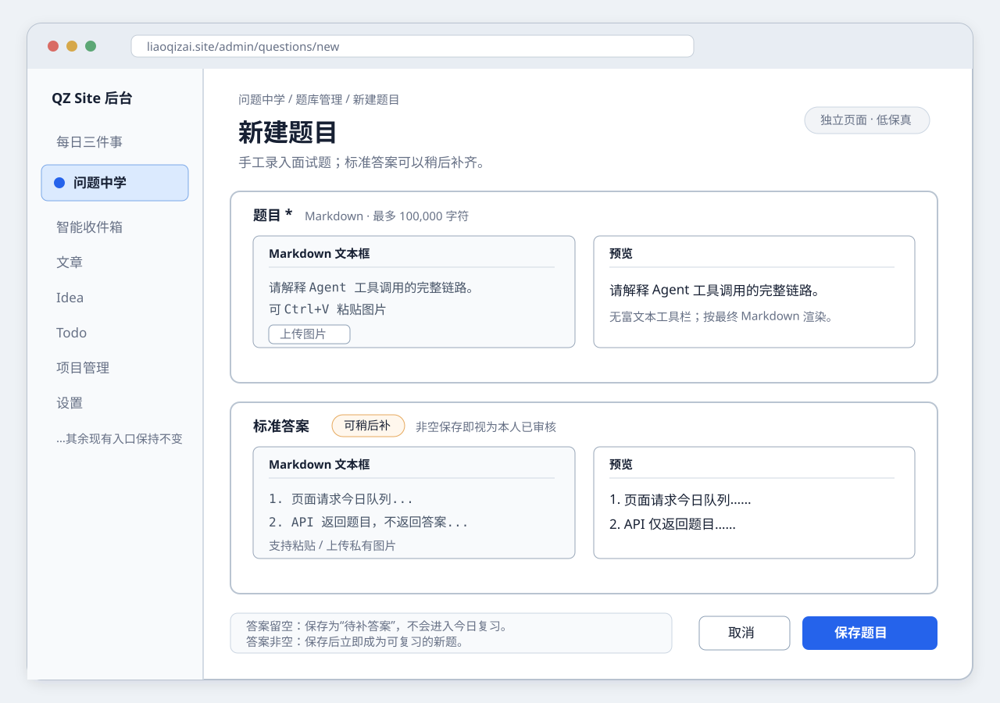

# 问题中学 V1：产品需求、功能规格与轻量架构

| 项目 | 内容 |
| --- | --- |
| 文档状态 | V1 已实现，本地验收完成，待生产发布 |
| 版本 | V1.0 |
| 定稿日期 | 2026-08-23 |
| 产品范围 | 私有单管理员后台 |
| 预期规模 | 约 500 题，不设硬上限 |
| 主要读者 | 产品确认、前后端实现、测试与运维 |

> 实现状态（2026-08-23）：Question 页面、API、Prisma migration、FSRS 5.4.1 调度、私有图片、备份恢复脚本和发布后内部冒烟均已落入当前工作树。本地单元、事务集成、生产构建、桌面/移动端明暗主题浏览器与现有编辑器回归，以及 Docker Desktop 隔离环境中的 Compose 三服务、私有题图权限、内部 Question 冒烟和完整备份恢复演练均已通过；尚未发布到生产，也未在真实生产 Docker 主机执行部署或恢复演练。

## 1. 一句话说明

“问题中学”是一套私有的面试题学习工具：用户手工录入题目和本人审核过的标准答案，学习时先只看题目并自己作答，再揭晓答案、自评四档，由 FSRS 安排下一次复习。

## 2. 背景与目标

当前个人网站已经有私有后台、每日三件事、文章、Idea、Todo 等模块，但没有独立题库，也没有间隔复习排程。面试题通常不是一句话识别题，而是需要脱离提示完整口述调用链、对象状态或设计取舍，因此本功能强调三件事：

1. **先检索，后对照**：没有揭晓前，页面和接口都不能提前带出标准答案。
2. **答案由本人把关**：题目和标准答案均由用户手工录入；非空标准答案保存后即视为本人已审核。
3. **按记忆安排复习**：不做随机刷题或手工掌握度，而是根据每次自评更新 FSRS 卡片状态和到期时间。

### 2.1 成功标准

- 可以先只录问题，之后再补标准答案；待补题不会误入学习队列。
- 今日复习始终优先处理已到期旧题，再在每日额度内引入新题。
- 用户揭晓前，网络响应和隐藏 DOM 中都不存在标准答案或历史作答。
- 正常作答永久只保留每题最近两次正文，但完整复习元数据永久保留。
- 题目、历史、排程和图片均只对当前登录管理员可见。
- Daily 页面能提示今日复习状态，但不改变每日三件事的三个槽位及原统计口径。

### 2.2 V1 不做

- 公开题库、多用户共享、协作与权限分组。
- AI 出题、AI 改写、AI 评分或正确率判定。
- 分类、标签、批量导入、题库市场。
- 顺序练习、随机练习、自由练习或跳过到期旧题。
- 硬删除题目、恢复被淘汰的旧作答正文、标准答案版本历史。
- FSRS 参数训练/优化、评分前间隔预览。
- raw HTML、数学公式和 Mermaid 渲染。

### 2.3 V1 工程默认值

以下不是学习方法本身的产品规则，而是为匹配现有站点边界、约 500 题规模并避免实现分叉而锁定的工程默认值；改变时应先修订本文和验收用例：

- 题目、标准答案和我的答案各最多 100,000 个 Unicode 字符。
- 题库与时间线每页 20 条。
- 图片沿用现站能力边界：单文件 5 MiB，JPG/PNG/GIF/WebP，24 小时无引用宽限期。
- `QuestionReviewTicket` 有效期 2 小时。

## 3. 术语与核心状态

| 术语 | 定义 |
| --- | --- |
| 题目 | 用户手工录入的 Markdown 问题，必填。 |
| 标准答案 | 用户手工录入并自行审核的当前答案；允许暂时为空。 |
| 待补答案 | 标准答案为空的题目；可编辑、搜索和停用，但不进入复习。 |
| 可复习 | 标准答案非空且题目已启用。 |
| 我的答案 | 用户在学习页当次输入的 Markdown；禁止图片。 |
| 正常作答 | 输入非空答案后揭晓，再选择 Again/Hard/Good/Easy。 |
| 直接揭晓 | 未输入有效内容就揭晓；系统自动记为 Again。 |
| 逻辑复习动作 | 一次题目揭晓并产生评分的记录；点下一题前改档仍是同一动作。 |
| New | 尚未完成当前排程周期首次评分的新卡。 |
| 旧题 | FSRS 状态为 Learning、Review 或 Relearning 的卡。 |
| 当前到期 | 可复习旧题的 `dueAt <= 当前绝对时间`。 |

题目是否启用与答案是否补齐是两个独立维度。例如，启用但无答案仍是待补；停用但有答案仍保留原排程，只是不进入队列。

## 4. 信息架构

### 4.1 页面与导航

- 后台桌面和移动导航增加一级入口“问题中学”，指向 `/admin/questions`。
- `/admin/questions` 内只有两个标签：
  - **今日复习**：默认标签。
  - **题库管理**。
- 新建和编辑使用独立页面：
  - `/admin/questions/new`
  - `/admin/questions/[id]`
- `/admin` 的每日三件事页面增加独立“今日复习”卡片，点击后进入 `/admin/questions`。

### 4.2 新建页低保真线框图

下图是信息层级与交互边界，不是最终视觉稿。图中使用普通 Markdown 文本框和预览，不复用现有 Milkdown 富文本式文章编辑器。



线框图使用不透明浅色画布，保证在浅色和深色 Markdown 预览器中都有稳定对比度。实现时移动端把“文本框 / 预览”改为上下排列，不做横向压缩。

## 5. 功能规格

### 5.1 新建题目

#### 输入

- 题目：必填，去除首尾空白后不得为空，最多 100,000 个 Unicode 字符。
- 标准答案：可空；非空时最多 100,000 个 Unicode 字符。
- 标准答案为空字符串或去除首尾空白后为空时，服务端统一存为 `null`，不能创建“只有空白但被视为可复习”的题。
- 题目和标准答案均使用 Markdown 文本框；桌面端输入与实时预览并排，移动端上下排列且预览在输入框之后。
- 两个字段都支持 Ctrl+V 粘贴图片和“上传图片”按钮。

#### 保存结果

| 输入状态 | 保存结果 |
| --- | --- |
| 题目非空、标准答案为空 | 创建为启用的待补题；`newQueueAt = null`，不进入复习。 |
| 题目和标准答案均非空 | 创建为启用的 New 卡；保存时刻写入 `newQueueAt`。 |
| 题目为空 | 拒绝保存并在题目字段附近提示。 |

“标准答案非空”本身就是审核动作，不增加草稿、待审核或二次批准流程。

### 5.2 题库管理

#### 默认列表

- 默认只展示“启用且标准答案非空”的题目。
- 每页固定 20 条，服务端分页。
- 默认排序：当前到期旧题按 `dueAt ASC, id ASC`；其后其他可复习题按下一到期时间排列；New 按 `newQueueAt ASC, id ASC`。
- 每行展示：题目摘要、FSRS 状态、是否到期、下一到期时间、最新评分、更新时间和操作入口。
- 列表不展示标准答案正文，也不展示“我的答案”正文。

#### 搜索和筛选

- 搜索只匹配题目和当前标准答案，不搜索历史“我的答案”。
- 搜索结果仍不得在列表摘要中泄露标准答案，只用匹配命中决定是否出现。
- 状态筛选：全部可复习、当前到期、稍后到期、New、待补答案、已停用。
- 最新评分筛选：无评分、Again、Hard、Good、Easy。
- 页面单独显示待补数量，便于补答案。

#### 停用与重新启用

- V1 不提供 DELETE API 或删除按钮。
- 停用只设置 `enabled = false`，保留题目、答案、图片、当前 FSRS Card、全部日志和两次作答正文。
- 重新启用恢复原排程：若 `dueAt <= now`，立即成为当前到期旧题；若仍在未来，保持原时间。
- 无标准答案的题即使重新启用，仍是待补题。

### 5.3 编辑题目

#### 内容编辑

- 编辑页加载题目、当前标准答案、状态信息、最近两次作答和评分时间线。
- 保存已具备标准答案的题目内容时，必须二选一：
  1. **保留复习进度**：只增加内容版本，不改变 Card 和到期时间。
  2. **重置为新题**：用 `createEmptyCard(now)` 建立全新 Card，增加排程版本，并以重置时刻写入 `newQueueAt`。
- 重置后的题再次计入当天新题额度；它不会作为“旧题”绕过额度。
- 不使用 `forget()` 实现内容重置，因为 V1 的语义是干净的新卡，而不是保留 `last_review` 的遗忘操作。

#### 清空和补齐标准答案

- 将非空标准答案清空时，无需再询问排程策略：题目自动变为待补，Card 重置为 New，`newQueueAt = null`。
- 后续重新补齐标准答案时，以补齐时刻写入 `newQueueAt`，而不是使用最初创建时间。
- 历史评分日志和仍被保留的最近两次作答正文不受清空、补齐或重置影响。

### 5.4 今日复习首页

首页显示：

- 当前到期旧题数量。
- 今日已引入新题数、每日新题上限和剩余额度。
- 今日累计复习小结。
- 每日新题上限输入，默认 10，允许 1–100。
- 当前题目，或“暂时完成 / 今日已完成”状态。

当日中途下调额度时，不回滚已学习的新题；剩余额度为 `max(0, 新上限 - 今日已引入数)`。上调后立即开放新增额度。

### 5.5 队列规则

每次请求下一题都重新基于服务器数据选取，不持久化“整轮题目 ID 快照”。顺序固定为：

1. 查询当前用户所有启用、答案非空、状态为 Learning/Review/Relearning 且 `dueAt <= now` 的题目。
2. 若存在旧题，按 `dueAt ASC, id ASC` 返回第一题；旧题没有每日数量上限。
3. 只有当前到期旧题为零时，才检查新题额度。
4. 若仍有额度，按 `newQueueAt ASC, id ASC` 返回第一张 New 卡。
5. 若没有当前可做题，查询所有非 New 旧题中满足 `now < dueAt < 上海次日零点` 的最早时间；存在则返回 `WAITING` 及 `nextDueAt`。这同时覆盖 Learning、Review 和 Relearning。
6. 既无当前题，也无本上海自然日内稍后到期的旧题时，返回 `DONE`。

这意味着旧题积压时，新题会持续等待；这是“旧题永远优先”的产品规则，不是异常。已经从 New 完成首次评分的题（例如评 Again 后约十分钟再次到期）属于旧题，后续复习不再消耗新题额度。

队列优先级在签发 ticket 时确定。用户作答期间即使另一张旧题刚好到期，也不使当前 ticket 失效；完成当前动作后，下一次选题再回到旧题优先。New 的首次评分和直接揭晓必须在事务中重新核对上海日期及剩余额度；若跨日、额度被下调或其他并发动作已用尽额度，返回 409 并重新开始队列，不能超发。

### 5.6 学习页初始状态

- 一次只展示一道题。
- 初始 `POST /api/questions/today/start` 会签发短期 `QuestionReviewTicket`；响应只含题目、题目 ID、`reviewKey`、预期内容版本和预期排程版本。
- 标准答案、最近作答和历史日志不得出现在该响应、服务端组件 props、HTML 或隐藏 DOM 中。
- “我的答案”每次进入新题都为空；不会自动带入上一次作答。
- “我的答案”支持常见 Markdown、GFM、表格和代码块，但隐藏图片能力，服务端也拒绝任何 Markdown 图片节点。

### 5.7 正常作答

1. 用户输入非空答案。
2. 点击“对照答案”。
3. 客户端把当前答案原文、内容版本和排程版本提交给 reveal API，然后锁定正文。
4. 服务端用 UTF-8 原文计算 SHA-256，ticket 只暂存摘要而不保存正文；随后才返回当前标准答案和最近两次正常作答。
5. 用户选择“重来 Again / 困难 Hard / 良好 Good / 简单 Easy”。
6. 第一次评分再次提交原文；服务端核对摘要一致后，原子保存逻辑复习日志、当次答案正文和更新后的 Card。
7. 点“下一题”前允许改评分；改档只改同一 `reviewKey` 的日志和 Card，不新增动作或答案正文。
8. 点击“下一题”后锁定评分并进入下一题。

如果用户已经揭晓但尚未评分便刷新或离开，本次答案和复习动作都不保存。

### 5.8 直接揭晓

- reveal 是否属于直接揭晓完全由服务端根据 `answerMarkdown.trim()` 判断，客户端不能自行声明模式或用空正文进入正常作答。
- 作答内容去除空白后为空时，点击揭晓即视为直接揭晓。
- reveal API 在一个事务中：
  - 对当前 Card 执行 `Rating.Again`。
  - 创建来源为 `DIRECT_REVEAL` 的永久日志。
  - 更新当前 Card。
  - 立即写入 `ratingLockedAt`，使 Again 不可改档。
  - 不创建 `QuestionAttempt`。
- 页面随后显示标准答案和最近两次正常作答，用户仍需点击“下一题”进入后续题目。

### 5.9 四档评分语义

| 按钮 | 用户判断 | FSRS 含义 |
| --- | --- | --- |
| 重来 Again | 没有回忆起来，或直接揭晓 | 失败；New/Learning 的单步学习为 10 分钟，Review 遗忘后进入 10 分钟重学。 |
| 困难 Hard | 回忆成功，但犹豫或很费力 | 成功，不可用来代替 Again。 |
| 良好 Good | 正常回忆成功 | 成功。 |
| 简单 Easy | 几乎不费力地完整回忆 | 成功。 |

V1 不显示评分对应的下一间隔，避免为了想要某个日期而误选档位。下一到期时间只在题库管理中显示。

单一 `learning_steps: ["10m"]` 不是“四档都十分钟”。在 `ts-fsrs@5.4.1` 的单步策略中，New/Learning/Relearning 的 Again 为 10 分钟，Hard 为约 15 分钟，Good/Easy 因没有下一学习步骤而毕业并由 FSRS 计算日级间隔；Review 状态只有 Again 进入 10 分钟重学，其他三档继续按 FSRS 计算。实现不得手写覆盖这些间隔，分钟级是否到期始终以绝对 `dueAt` 为准。

### 5.10 改档、离开和并发

- 第一次正常评分后，当前页面可以用同一 `reviewKey` 改档；首次响应返回 `reviewRevision`。
- 首次评分把 `revisionCount` 初始化为 0；每次真正改成不同评分才加 1。同评分幂等重试不增加 revision，响应中的 `reviewRevision` 始终等于当前 `revisionCount`。
- 改档请求携带 `expectedReviewRevision`。服务端先用该日志回滚当前 Card，再使用日志中保存的 **5.4.1 参数快照**、第一次评分的原始 `reviewedAt` 和新评分重新执行 `next()`。
- 改档必须同时满足：日志尚未锁定、当前 Card 与该日志的 `afterCard` 一致、它仍是最后一次 Card mutation、`scheduleVersionAfter` 匹配、题目当前 `contentVersion` 与日志固化版本一致，且题目未被重置或停用；否则返回 409 并刷新队列。
- 改档用 `UPDATE ... WHERE revisionCount = expectedReviewRevision` 做 CAS；成功后只增加日志 revision，Card 的 `scheduleVersion` 保持首次评分后的版本不再递增。两个不同并发改档只能一个成功。
- 同一动作的答案正文不可更改；重复请求相同评分必须幂等。
- 点击“下一题”显式写入 `ratingLockedAt` 和 `advancedAt`。
- `advance` 以旧 `reviewKey` 幂等：第一次结算后若其签发的后继 ticket 仍是该用户唯一 active ticket，网络重试直接返回该 ticket；若后继已被消费、取消或前进，则返回 409 `RESYNC_REQUIRED`，由客户端调用 start，绝不能再次推进旧 Card。第一次没有后继 ticket 时，重试只重新读取 queue summary：仍无题就返回当前 WAITING/DONE，若此时已有可做题则返回 `RESYNC_REQUIRED`，不在旧请求中重新签发。
- 正常路由离开或刷新时，客户端使用 keepalive 最佳努力锁定并前进；浏览器崩溃或断网时无法保证离开瞬间送达。
- 下一次非预取的 `POST /api/questions/today/start` 是 no-resume 的权威兜底：先处理该用户所有 `advancedAt IS NULL` 的上一动作，未锁的先写 `ratingLockedAt`，随后写 `advancedAt`；已锁定但尚未前进的直接写 `advancedAt`。旧 `reviewKey` 后续改档返回 409。
- 若上一张 ticket 只揭晓而未评分，start 会取消 ticket，不创建日志或答案正文。
- 并发标签页以短期 ticket、每用户最多一个 `advancedAt IS NULL` 的动作、`scheduleVersion`、`contentVersion`、review revision CAS 和 Serializable 事务防止双写；冲突返回 409，不静默覆盖。
- `start`、首次评分、改档、直接揭晓和 `advance` 的数据库事务使用 Serializable 隔离级别。仅对 Prisma `P2034` 冲突最多执行 3 次（首次加 2 次重试），且提交前不得发送外部副作用；仍冲突时统一返回 409 `REVIEW_CONFLICT`，不能落入通用 500。

### 5.11 当前页面内返回查看

- 学习卡底部提供“上一条已完成”和“回到当前题/下一条已完成”按钮；没有对应记录时按钮禁用。
- 未刷新时，可在客户端按完成顺序返回查看本次页面中已经完成的题目。
- 已完成题的题目、我的答案、标准答案和最终评分均只读。
- 只有最新尚未完成的当前题允许继续输入、揭晓或评分；从历史查看区点击“回到当前题”返回它。
- 此浏览历史只存在当前页面内存；刷新或离开后不恢复。

### 5.12 最近两次作答与永久时间线

- 只有正常作答并完成第一次评分时才保存 `QuestionAttempt`。
- 每题只保留最近两条作答正文；第三条写入的同一事务删除最旧正文行。
- 删除旧正文不删除 `QuestionReviewLog`，因此算法历史、时间、来源和评分分布永久存在。
- 最近两次作答在揭晓后和编辑页展示，每条显示正文、首次评分时间和当前最终评分。
- 编辑页时间线每页 20 条，按时间倒序，展示：时间、双语评分、正常作答/直接揭晓、原到期时间、更新后到期时间、状态迁移，以及内容重置事件。

### 5.13 今日小结

所有日统计使用 `Asia/Shanghai` 自然日：

- **复习动作数**：当天首次保存的逻辑复习日志数量；同一题再次到期后重新作答并评分算新动作，改档不新增动作。
- **去重题数**：当天日志的 `distinct questionId`。
- **来源分布**：正常作答和直接揭晓数量。
- **评分分布**：按每条逻辑日志当前最终评分聚合；改档只移动评分桶。
- **今日新题数**：当天 `stateBefore = New` 的逻辑复习日志数量；重置后再次学习会再次消耗额度。

每条日志第一次保存时同时固化 UTC `reviewedAt` 和由它换算出的上海 `reviewDate`。跨午夜改档沿用原时间和原日期，不把统计移动到第二天。FSRS 的 `dueAt` 始终是绝对时间；上海时区只决定产品日界和日额度。

### 5.14 Daily 页面卡片

- 在现有每日三件事正文中增加独立“今日复习”卡片，放在三个任务区域之后、统计区域之前。
- 卡片不创建 `DailyTask`，不占 slot 1–3，不参与完成率、连续天数和月度平均进度。
- 卡片状态：
  - 有当前到期旧题：显示“到期旧题 X 道”。
  - 无到期旧题但有可引入 New：显示“可学习新题 · 剩余额度 Y”。
  - 无当前题但本自然日稍后有旧题：显示“暂时完成 · HH:mm 后还有复习”。
  - 无剩余任务：显示“今日已完成”。
- 点击整张卡或主按钮进入 `/admin/questions`。
- Daily 卡片与问题中学首页必须消费同一个只读 queue summary，不能各自复制一套判断逻辑。

## 6. Markdown 与私有图片

### 6.1 编辑和渲染

- 新增后台安全的 `QuestionMarkdownEditor`：桌面端为普通 textarea 与实时预览并排；移动端为上下排列、预览在输入框之后；包含粘贴/上传钩子。
- 不直接复用当前 `PostEditor`，避免把 Milkdown 富文本交互、数学公式、表格菜单和固定高度带入题目页。
- 新增 `QuestionMarkdown` 渲染器，使用现有 `react-markdown + remark-gfm + rehype-highlight` 依赖；不启用 `rehypeRaw`、`remark-math`、KaTeX 或 Mermaid。
- 外部链接可以按现有安全协议打开；图片必须通过题目私有图片校验。

### 6.2 私有文件边界

现有 `public/uploads` 由 Nginx 直接公开，不能用于题目图片。问题中学使用独立目录：

- 宿主机：`data/study-uploads`
- Web 容器：`/app/data/study-uploads`
- Nginx：**不得挂载**该目录，也不得新增静态 location。

读取图片只能走 `GET /api/questions/images/[id]`：登录且 owner 匹配后，仅在“存在题目引用”或“尚未绑定且 `unreferencedAt > now - 24h`”时流式返回；后一条用于新建/编辑保存前预览。响应设置 `Cache-Control: private, no-store` 和 `X-Content-Type-Options: nosniff`。

### 6.3 图片规则

- 单文件最大 5 MiB，只允许 JPG、PNG、GIF、WebP；同时验证扩展名、声明 MIME 和文件魔数。
- 文件名使用不可预测存储键，不包含原文件名或题目内容。
- 上传成功返回 `/api/questions/images/[id]`，编辑器插入标准 Markdown 图片语法。
- 题目和标准答案只允许本站上述 API URL；拒绝 `/uploads`、任意相对路径、外部 HTTP(S)、协议相对地址和 data URL。
- “我的答案”前端不提供图片入口，服务端解析 Markdown AST 并拒绝所有图片节点。
- 新建题目前上传的图片处于未绑定状态；保存时解析正文中的图片 ID，在同一事务同步 `QuestionImageReference`。
- 新上传图片初始化 `unreferencedAt = now`；首次绑定时置为 `null`，最后一条引用解除时重新写入当前时间。只有 `unreferencedAt` 满 24 小时后才可清理；停用题仍保留引用。
- 上传先把验证通过的完整文件以不可覆盖方式落到随机存储键，再创建 `QuestionImage` 行；数据库写入失败时立即最佳努力删除文件，进程中断遗留的无记录文件交给 24 小时清理。禁止先创建可读取的数据库行再慢慢写文件。
- 保存正文时对“原引用与新引用的并集”按 image ID 稳定排序并锁定对应 `QuestionImage` 行，再同步引用和最终引用数：大于 0 写 `unreferencedAt = null`，等于 0 且原值为 null 时写当前时间。并发解除最后几条引用也必须串行得到一个正确时间点。

## 7. FSRS 配置与版本边界

实现固定精确依赖，不使用 `^`：

```json
{
  "ts-fsrs": "5.4.1"
}
```

调度器参数固定为：

```ts
const parameters = generatorParameters({
  request_retention: 0.9,
  maximum_interval: 365,
  enable_fuzz: false,
  enable_short_term: true,
  learning_steps: ["10m"],
  relearning_steps: ["10m"],
})

const scheduler = fsrs(parameters)
```

- 目标记忆保持率为 90%，最大间隔为 365 天。
- 关闭 fuzz，保证相同前置 Card、原评分时间和评分产生确定性结果，便于改档与测试。
- V1 不安装或调用参数优化器，但永久日志保留未来训练所需的算法元数据。
- 每条日志直接序列化本次调度实际使用的同一个 `parameters` 对象，并保存 `schedulerVersion = "5.4.1"`，避免“调度参数”和“日志参数”分别补全后发生漂移。
- 5.4.1 的 `elapsed_days`、`last_elapsed_days` 已标记未来废弃，但当前 `rollback()` 仍依赖它们；V1 必须完整保存，不能提前删除。
- 未来升级到 6.x 或更高版本必须单独设计迁移、历史回放和排程差异验收，禁止直接修改依赖版本。

官方依据：

- [`ts-fsrs` 5.4.1 包信息与 Node >= 20 要求](https://github.com/open-spaced-repetition/ts-fsrs/blob/v5.4.1/packages/fsrs/package.json)
- [参数、`next()`、`rollback()` 与状态说明](https://github.com/open-spaced-repetition/ts-fsrs/blob/v5.4.1/packages/fsrs/README.md)
- [Card 与 ReviewLog 完整字段](https://github.com/open-spaced-repetition/ts-fsrs/blob/v5.4.1/packages/fsrs/src/models.ts)
- [单一学习步骤的具体分档行为](https://github.com/open-spaced-repetition/ts-fsrs/blob/v5.4.1/packages/fsrs/src/strategies/learning_steps.ts)
- [FSRS 关于单个 10–30 分钟同日学习步骤的建议](https://github.com/open-spaced-repetition/fsrs4anki/blob/main/docs/tutorial.md?plain=1)

## 8. 调用链与对象状态

### 8.1 小白版调用链

| 场景 | 在哪调用 | 谁传入 | 谁消费/产生结果 |
| --- | --- | --- | --- |
| 查看今日概况 | Daily 卡片或问题中学首页调用只读 today API | 页面带当前 Session | 服务端返回数量、额度、小结和 WAITING/DONE 提示，不改变记录 |
| 开始/刷新学习 | `/admin/questions` 调用 start API | 当前 Session | 服务端先结算上一动作，再按队列签发绑定题目与版本的短期 ticket，只返回题目 |
| 揭晓答案 | 学习页调用 reveal API | `reviewKey`、答案原文、内容/排程版本 | 服务端绑定答案摘要后才返回标准答案与两次作答；空白原文自动走直接揭晓并写 Again |
| 正常评分 | 学习页调用 rating API | 锁定的我的答案、评分、内容/排程版本 | 服务端调用 `ts-fsrs.next()`，保存日志、答案和新 Card |
| 改评分 | 同一 rating API | `reviewKey`、新评分、期望日志 revision | 服务端 rollback 上次结果，再以原时间和原参数重算并覆盖同一日志 |
| 下一题 | 学习页调用 advance API | 当前 `reviewKey` | 服务端锁定并前进，再按队列规则签发下一张 ticket |

可以把 `Question` 理解为“题目卡片当前状态”，`QuestionReviewLog` 是“永远不丢的流水账”，`QuestionAttempt` 则是“只留下最近两张的作答照片”。删掉第三旧的作答照片，不会删掉流水账。

### 8.2 关键不变量

- 当前 Card 只允许由一次成功事务推进一个版本。
- 每个 `reviewKey` 由服务端 ticket 绑定唯一 owner、题目、内容版本和排程版本，过期或取消后不可复用。
- 评分修改只能作用于当前 Card 的最后一条、尚未锁定的日志。
- 初始学习响应永远不含答案；隐藏 UI 不等于安全，服务端响应本身必须不返回。
- 新题额度只限制 New 的首次评分，不限制 Learning/Review/Relearning。
- 标准答案为空、题目停用或 owner 不匹配时，任何评分请求都必须失败。

## 9. 数据设计

以下是 V1 的概念模型和必须字段；实现时使用 Prisma migration，并给 `User` 增加对应 relations。

### 9.1 `Question`

- 身份与内容：`id`、`ownerId`、`promptMarkdown`、`referenceAnswerMarkdown?`、`enabled`。
- 队列：`newQueueAt?`、`latestRating?`。`latestRating` 只表示永久日志中最新逻辑动作的最终评分，并在首次评分/改档事务中同步；reset 后仍保留。
- 版本：`contentVersion`、`scheduleVersion`。
- 完整 FSRS Card：`dueAt`、`stability`、`difficulty`、`elapsedDays`、`scheduledDays`、`learningSteps`、`reps`、`lapses`、`state`、`lastReviewAt?`。
- 审计：`createdAt`、`updatedAt`。
- 主要索引：owner + enabled + state + dueAt；owner + enabled + newQueueAt；owner + updatedAt。
- 除主键外增加 `@@unique([id, ownerId])`，供所有带冗余 owner 的子表建立数据库级复合外键。

`referenceAnswerMarkdown = null` 是待补答案的唯一数据库表达，不再额外存一个可能漂移的 ready 布尔值。

FSRS Card 的 `lastReviewAt` 与列表用的 `latestRating` 含义不同：内容 reset 使用 `createEmptyCard(now)` 后 `lastReviewAt = null`，但历史最新评分仍可保留展示。

### 9.2 `QuestionReviewLog`

- `id`、`reviewKey @unique`、`questionId`、`ownerId`。
- `source`：`TYPED` 或 `DIRECT_REVEAL`。
- `rating`：Again/Hard/Good/Easy。
- `stateBefore`：New/Learning/Review/Relearning 的标量快照，供新题额度和统计查询使用。
- `reviewedAt`（UTC 时间戳）、`reviewDate DateTime @db.Date`（由服务端按 Asia/Shanghai 计算，客户端不得提交）。
- `beforeCard`、`afterCard`：完整 Card JSON 快照。
- `fsrsReviewLog`：官方 ReviewLog 完整字段，包括当前仍由 rollback 使用的 `last_elapsed_days`。
- `schedulerVersion`、`parametersSnapshot`、`contentVersion`。
- `scheduleVersionBefore`、`scheduleVersionAfter`、`revisionCount`。
- `ratingLockedAt?`、`advancedAt?`、`createdAt`、`updatedAt`。
- migration 建立“每用户最多一条 `advancedAt IS NULL` 日志”的 PostgreSQL partial unique index；Prisma schema 之外的 SQL 约束必须留在 migration 中并由测试覆盖。
- 统计索引至少包含 `(ownerId, reviewDate)` 与 `(ownerId, reviewDate, stateBefore)`。

### 9.3 `QuestionAttempt`

- `id`、`ownerId`、`questionId`、`reviewLogId @unique`、`answerMarkdown`、`createdAt`。
- 每题最多两行；第三次写入时在同一事务删除按 `createdAt, id` 最旧的行。

### 9.4 其他模型

- `QuestionReviewTicket`：`reviewKey @unique`、owner、question、`contentVersion`、`scheduleVersion`、签发/过期时间、`answerDigest?`、服务端判定的揭晓模式与时间、关联日志、`cancelledAt?`、`consumedAt?`、自关联 `successorTicketId? @unique`。ticket 有效期为 2 小时，不计入复习统计；正常揭晓只临时保存答案原文的 SHA-256，不保存正文。advance 在同一事务把新 ticket 记为当前 ticket 的 successor，用于网络重试；migration 用 partial unique index 保证每用户最多一张未取消且未消费的 ticket。
- `QuestionScheduleResetLog`：题目、操作者、重置时间、`reason` 枚举、before/after Card、前后 content/schedule version。
- `QuestionPreference`：`userId @unique`、`dailyNewLimit`，无记录时读取默认值 10。
- `QuestionImage`：owner、`storageKey @unique`、MIME、字节数、SHA-256、创建时间、`unreferencedAt?`。
- `QuestionImageReference`：`ownerId`、image、question、字段类型 `PROMPT | REFERENCE`；保存正文时同步。

所有冗余 owner 都由数据库约束而不只靠应用判断：`QuestionReviewLog` 通过 `(questionId, ownerId)` 复合外键指向 Question；Ticket 提供 `(reviewKey, questionId, ownerId)` 唯一键，ReviewLog 再以同名三字段复合外键指向 Ticket，保证同一 key 的 owner 与题目不可漂移。ReviewLog 另提供 `(id, questionId, ownerId)` 唯一键，`QuestionAttempt` 同时以 `(reviewLogId, questionId, ownerId)` 指向它；Ticket 和 ResetLog 也用 `(questionId, ownerId)` 指向 Question。`QuestionImage` 增加 `(id, ownerId)` 唯一键，ImageReference 分别以 `(imageId, ownerId)` 和 `(questionId, ownerId)` 指向图片与题目，并增加 `@@unique([imageId, questionId, fieldType])`。这样即使某段代码漏写 owner 条件，也不能形成跨用户关联或重复引用。

Ticket 状态约束固定如下：签发时 `cancelledAt = consumedAt = null`；TYPED reveal 只写 mode、`revealedAt` 和 `answerDigest`，仍未消费；正常 CREATE 或 DIRECT_REVEAL 创建永久日志时，必须在同一事务关联日志并写 `consumedAt`。消费或取消时都清空 `answerDigest`，避免最近两条正文淘汰后仍永久留下可猜测摘要；CREATE 重试改用当前 ReviewLog 与其 Attempt 校验。`cancelledAt` 与 `consumedAt` 互斥，已取消 ticket 不得关联日志，已关联日志必有 `consumedAt` 且没有 `cancelledAt`；这些组合使用数据库 CHECK/外键和事务测试共同保证。

## 10. API 契约

所有 API handler 都必须独立调用 `ensureAuthenticated()`，不能只依赖 `/admin` 布局保护。私有 JSON 响应统一 `Cache-Control: private, no-store`；写请求按现有约定校验同源 Origin、Content-Type 和字段白名单。成功和失败响应都必须经过 `privateNoStore`，实现时新增 `handlePrivateApiError()` 包装现有 `handleApiError()`，避免 400/401/403/404/409/500 错误被浏览器或中间层缓存。

### 10.1 题库与设置

| 方法与路径 | 用途 | 关键约束 |
| --- | --- | --- |
| `GET /api/questions` | 分页、搜索、筛选 | owner 隔离；默认不返回标准答案正文。 |
| `POST /api/questions` | 手工创建 | 题目必填；标准答案空/非空决定 pending/New。 |
| `GET /api/questions/[id]` | 编辑页完整数据 | 仅 owner；可以返回标准答案和时间线摘要。 |
| `PATCH /api/questions/[id]` | 编辑或停用/启用 | 使用判别式 operation；内容编辑显式给排程策略。 |
| `GET /api/questions/[id]/history` | 永久时间线分页 | 每页 20 条；不返回已淘汰正文。 |
| `GET/PATCH /api/questions/preferences` | 读取/修改新题额度 | 整数 1–100。 |

`PATCH` 只接受两种互斥结构：

```ts
type QuestionPatch =
  | {
      operation: "EDIT_CONTENT"
      promptMarkdown: string
      referenceAnswerMarkdown: string | null
      schedulePolicy: "KEEP" | "RESET" | null
      expectedContentVersion: number
      expectedScheduleVersion: number
    }
  | {
      operation: "SET_ENABLED"
      enabled: boolean
    }
```

状态转换契约固定如下：

| 编辑前 | 编辑后 | `schedulePolicy` | 排程结果 |
| --- | --- | --- | --- |
| 待补 | 待补 | 必须为 `null` | 保持不可入队，只增加内容版本。 |
| 待补 | 可复习 | 必须为 `null` | 以当前时间初始化 New 并写 `newQueueAt`。 |
| 可复习 | 待补 | 必须为 `null` | 强制重置 New、清空 `newQueueAt`，退出队列。 |
| 可复习 | 可复习 | 必须为 KEEP 或 RESET | 按用户显式选择保留或重置。 |

客户端传入不适用的策略时返回 400，而不是猜测。任何内容变化都会增加 `contentVersion`，使旧 ticket 的揭晓和首次评分返回 409。

### 10.2 今日队列

`GET /api/questions/today` 是纯只读接口，只返回公共统计、设置、queue summary 和 WAITING/DONE 提示，供首页和 Daily 卡片复用；它不得签发题目、锁定日志或推进状态。

首次进入、刷新或异常离开后重新进入学习区时，客户端显式调用非预取的 `POST /api/questions/today/start`。该 POST 原子结算上一动作、取消未评分旧 ticket、选择队首并签发新 ticket，然后返回以下互斥状态之一：

```ts
type TodayQuestionState =
  | {
      state: "READY"
      question: {
        id: string
        promptMarkdown: string
        reviewKey: string
        contentVersion: number
        scheduleVersion: number
      }
    }
  | { state: "WAITING"; nextDueAt: string }
  | { state: "DONE" }
```

`READY` 中禁止加入标准答案、历史答案、最新评分详情或任何可推导答案的字段。ticket 绑定这两个版本并在两小时后过期；start 会使此前未消费 ticket 失效。

### 10.3 学习动作

| 方法与路径 | 用途 | 主要结果 |
| --- | --- | --- |
| `POST /api/questions/reviews/[reviewKey]/reveal` | 正常对照或直接揭晓 | 校验 ticket 与版本；两种路径都返回标准答案和最近两次 typed attempts，空白原文路径额外原子写 Again。 |
| `PUT /api/questions/reviews/[reviewKey]/rating` | 正常作答首次评分/改档 | CREATE 首次写日志与正文；REVISE 用 CAS rollback 后覆盖同一日志。 |
| `POST /api/questions/reviews/[reviewKey]/advance` | 下一题/离开 | 幂等锁定并前进当前动作或取消未评分 ticket；需要继续时同时返回下一张 ticket。 |

reveal 请求包含 `answerMarkdown`、`expectedContentVersion` 和 `expectedScheduleVersion`。服务端根据 trim 后是否为空决定 TYPED 或 DIRECT_REVEAL；TYPED 把 UTF-8 原文 SHA-256 写入 ticket，DIRECT_REVEAL 不接受客户端覆盖评分。首次评分与改档使用判别式请求：

```ts
type RatingRequest =
  | {
      operation: "CREATE"
      answerMarkdown: string
      rating: "AGAIN" | "HARD" | "GOOD" | "EASY"
      expectedContentVersion: number
      expectedScheduleVersion: number
    }
  | {
      operation: "REVISE"
      rating: "AGAIN" | "HARD" | "GOOD" | "EASY"
      expectedReviewRevision: number
    }
```

相同 CREATE 请求重试时，若正文、评分和版本都与已创建日志一致，直接返回当前结果；否则 409。REVISE 成功后返回新 `reviewRevision`；同评分重复请求可返回当前结果，不同评分使用旧 revision 必须 409。

CREATE 时服务端重新计算 `answerMarkdown` 摘要并与 ticket 比较；不一致即 409。因此揭晓后即使绕过前端修改请求体，也不能把新正文作为已揭晓前答案保存。

reveal 也必须幂等：未消费的 TYPED 使用相同正文摘要和版本重试时返回同一结果，不同摘要返回 409；已消费的 TYPED 改用现存 ReviewLog/Attempt 校验；DIRECT_REVEAL 网络重试命中已关联的同一日志时返回该既有结果，不重复推进 Card。ticket 的 2 小时有效期约束 reveal 与首次 CREATE；一旦已产生日志，REVISE 只按日志未锁定、revision 和版本条件判断。

### 10.4 私有图片

| 方法与路径 | 用途 | 主要结果 |
| --- | --- | --- |
| `POST /api/questions/images` | multipart 上传 | 返回 image ID 和私有 API URL。 |
| `GET /api/questions/images/[id]` | 私有读取 | owner 且已绑定，或 owner 且仍在 24 小时暂存期内，才流式返回。 |

图片 POST 不能调用只接受 JSON 的 `requireJsonRequest()`；它必须单独执行 `ensureAuthenticated()`、`requireAdminMutationOrigin()`，并严格要求 `multipart/form-data` 后再解析文件。

V1 不提供立即物理删除接口。编辑保存后只解除引用，由 24 小时宽限期清理任务处理，避免取消编辑或保存响应丢失时误删仍被引用文件。

### 10.5 发布后内部冒烟

- `POST /api/internal/question-smoke` 只接受 Web 容器内 `127.0.0.1:3000` 的直接请求；带转发来源或经 Nginx 公网访问时返回 404。
- 每轮生成一次性用户和 credential Account，经正式认证流程取得签名 Session Cookie，再通过真实 HTTP API 完成创建题目、start、输入答案揭晓和 Good 评分。
- 冒烟必须断言 start 响应不包含标准答案；无论成功或失败都清理本轮题目、日志、Session、Account 和用户。不得复用管理员凭据，也不得输出临时密码或答案正文。

## 11. 错误与空状态

| 场景 | 用户表现 | 服务端行为 |
| --- | --- | --- |
| 未登录 | 返回登录入口 | API 401。 |
| 越权题目/图片 ID | 显示不存在 | 统一 404，不暴露对象存在性。 |
| 非同源写请求 | 显示请求无效 | 403。 |
| 字段为空、过长或 Markdown 图片非法 | 字段附近明确提示 | 400，不产生部分写入。 |
| 排程版本冲突或旧 reviewKey 改档 | 提示“题目状态已变化，已刷新” | 409，不覆盖新状态。 |
| 图片过大/格式不符 | 上传区提示原因 | 应用层超过 5 MiB 或格式不符返回 400；请求体先触发既有 Nginx 6 MiB 上限时返回 413。前端把两种大小错误统一显示为“单张图片不能超过 5 MiB”，均不落盘。 |
| ticket 签发后内容被另一标签修改或答案被清空 | 返回题库并提示 | 409，不允许揭晓或评分。 |
| 当前无题、本自然日稍后有旧题 | “暂时完成”，展示时间 | `WAITING`。 |
| 今日真正无剩余题 | “今日已完成” | `DONE`。 |

## 12. 安全、隐私与数据保留

- 全部题目表按 `ownerId` 过滤，即使当前只有一个管理员。
- API 不记录题目、标准答案或我的答案正文到普通应用日志。
- 用户输入只通过 React/ReactMarkdown 安全渲染；不启用 raw HTML。
- 私有图片目录不进入 `public/`，不挂载给 Nginx。
- 数据库删除策略以 Restrict 为主；V1 没有题目硬删除入口。
- 评分日志和排程重置日志永久保留。
- 每题正常作答正文只保留最近两条；直接揭晓没有正文。
- 图片只要仍被启用或停用题的题目/标准答案引用，就不得清理。

## 13. 备份、部署与回滚

### 13.1 备份

- PostgreSQL dump 自动包含新增表。
- `ops/backup.sh` 增加 `data/study-uploads` 独立归档，并把数据库、公开 uploads、私有 study uploads 三者写入同一校验清单。
- 私有归档不得依赖宿主机维护用户恰好与容器 UID 相同：由 Web 容器的默认非 root 用户从 `/app/data/study-uploads` 生成 tar 并流式写入宿主机临时备份文件，禁止用 root 绕过读权限。这样应用可读与备份可读使用同一身份；流式命令或 tar 校验失败时整组备份失败。
- `ops/verify-backup.sh` 先拒绝绝对路径、`..`、重复条目、符号链接和非 `study-uploads/` 前缀，再在隔离恢复库查询 Question、ReviewLog、Attempt、Image 和 migration 计数。
- 校验脚本把恢复库中的每条 `QuestionImage.storageKey` 与私有归档交叉核对，要求文件存在且字节数、SHA-256 与数据库一致；任何已引用图片缺失都使整组备份失败。
- 恢复演练必须同时恢复数据库和私有图片，缺一视为失败。

### 13.2 私有图片清理

- 新增 `scripts/cleanup-study-uploads.ts` 与 `ops/cleanup-study-uploads.sh`。TypeScript 脚本默认 dry-run；只有同时传 `--apply` 且环境变量 `STUDY_UPLOAD_CLEANUP_CONFIRMED=1` 才允许删除。
- apply 先把“零引用但 `unreferencedAt IS NULL`”的异常行修复为当前时间，不能当场删除；再在事务中以 `unreferencedAt <= now - 24h` 且 `NOT EXISTS QuestionImageReference` 重新核对并删除到期数据库行，提交后再删对应文件。崩溃最多留下无数据库记录的文件，不能留下指向缺失文件的有效记录；后续轮次可清理由 mtime 证明已超过 24 小时的无记录文件。dry-run 只报告待修复与待删除集合，不写时间戳。
- `ops/cleanup-study-uploads.sh --apply` 在任何删除前调用 `ops/backup.sh study-upload-cleanup`；失败即停止，不得继续清理。
- `ops/maintenance.sh` 增加 `study-uploads-dry-run` 和内部受控的 `study-uploads` 动作；`ops/install-maintenance-cron.sh` 在每日备份之后的 03:20 调用后者。现有 03:00 备份、周日 03:30 校验、周一 SSL 和每小时 MCP 任务保持不变。

### 13.3 部署

- 使用已提交 Prisma migration 和 `prisma migrate deploy`，生产禁止 `prisma db push`。
- migration 只做向前兼容的新增表、nullable relation、索引和约束。
- `docker-compose.yml` 只把 `data/study-uploads` 挂载到 Web；Nginx 配置保持不挂载。
- 首次发布时，`ops/deploy.sh` 在拉取并确认不可变 Web 镜像后、`compose up` 前，从镜像内解析 `node` 运行用户的 UID/GID，以受控权限创建宿主机 `data/study-uploads`、设为 `0750` 并归属该 UID/GID；随后用同一镜像的默认非 root 用户挂载目录并执行 `test -w`。目录不可写则发布失败并触发现有应用回滚，不能等到第一次上传才暴露问题。
- 发布前完成备份，发布后执行匿名写保护，并由 Web 容器回环端点使用一次性认证身份完成创建/揭晓/评分及自清理冒烟验证。

### 13.4 回滚

- 应用失败时回滚到上一镜像；新增表和已写数据保留，不自动执行反向 migration。
- 只有确认数据库损坏时才停止写入并恢复发布前备份。
- `ts-fsrs` 升级失败不得用旧代码解释新日志；必须一起回滚应用依赖和调度实现。

## 14. 验收测试

### 14.1 单元测试

- Markdown 长度、空白归一、图片 allowlist、我的答案禁图。
- 题库查询参数、分页、搜索范围、稳定排序。
- 上海日期、额度上下调、今日聚合口径。
- FSRS Card/ReviewLog 序列化完整性和 5.4.1 参数快照。
- 单步学习行为：Again 10m、Hard 约 15m、Good/Easy 毕业；以库实际结果断言，不复制公式。
- rollback 改档使用原始 `reviewedAt`，结果与直接从 before Card 选择新评分一致。

### 14.2 数据库与事务测试

- owner 隔离；停用不删除；重新启用恢复原排程。
- 待补不入队；补齐按补齐时间入队；清空强制重置。
- 保留进度与重置进度两条编辑路径，历史均保留。
- 旧题无限优先；只有旧题清空后才引入 New；重置 New 再消耗额度。
- ticket 与 owner/题目/内容版本/排程版本绑定；过期、取消和 start 替换后不可使用。
- TYPED reveal 不消费 ticket；CREATE 才原子消费并关联日志。DIRECT_REVEAL 原子消费并关联日志；取消与消费不能同时出现，取消票不能关联日志。
- 同 reviewKey 重试不重复；改档不新增日志、额度或 Attempt。
- advance 响应丢失后用旧 reviewKey 重试，只返回仍有效的同一 successor；successor 已变化时返回 `RESYNC_REQUIRED`，旧 Card 不重复推进。
- 两个并发不同改档使用同一 review revision 时一成一 409；scheduleVersion 在同一逻辑动作改档时不重复增加。
- 模拟 Prisma `P2034`：前两次冲突、第三次成功时只产生一次推进；三次均冲突时返回 409 `REVIEW_CONFLICT`，不产生半条日志。
- 已锁定、已前进、已 reset 或版本过期的改档返回 409。
- KEEP 编辑后，旧 `contentVersion` 的 reveal 和首次 rating 返回 409。
- 已评分但尚未前进时发生 KEEP 内容编辑，旧动作的 REVISE 也返回 409；advance 仍可幂等结算该动作。
- 正常揭晓后改写答案正文再 CREATE 必须因摘要不一致返回 409；空白揭晓只能形成不可改档的直接 Again。
- 第三次正常作答后只剩最近两条正文，三条 ReviewLog 仍存在。
- 直接揭晓创建 immutable Again、零 Attempt。
- 已锁定但 `advancedAt = null` 的直接揭晓动作，会被下一次 start 正确前进而不是卡住。
- 无当前题但存在今天稍后到期的 Review 卡时返回 WAITING，不误报 DONE。
- 并发评分和多标签页下只允许一个合法 Card 推进。

### 14.3 API 与安全测试

- 匿名 401、恶意/缺失 Origin 403、错误 Content-Type 400、未知字段 400。
- 只读 today 和 start 的 READY 响应都不含答案、历史答案或答案片段；GET today 不产生数据库写入。
- 越权题目与图片统一 404。
- 外部图片、data URL、`/uploads` 和非本人私有图片均被拒绝。
- 所有私有 API 的成功和错误响应都含 `private, no-store`；私有图片额外含 `nosniff`，Nginx 静态路径不可访问。
- 5 MiB 应用拒绝和超过 Nginx 请求体上限的 413 都显示同一明确大小提示。

### 14.4 浏览器验收

- 桌面和手机、浅色和深色模式全部覆盖。
- 独立新建/编辑页：Markdown 输入、预览、Ctrl+V、按钮上传、可选标准答案。
- 学习首屏只显示题目；正常揭晓、直接揭晓、评分、改档、下一题和只读返回。
- 已评分未点下一题后刷新：回来不恢复旧界面，旧 reviewKey 不可再改。
- WAITING 和 DONE 文案、今日累计小结、新题额度调整。
- Daily 卡片覆盖“到期旧题 / 可学新题 / 稍后到期 / 今日完成”四种状态，并与学习首页数量一致。
- 题库分页、搜索、筛选、待补数量、停用/启用和完整时间线。
- Daily 卡片不改变三个槽位、进度、连续天数和月度统计。
- 回归现有文章编辑器，确保新增 QuestionMarkdownEditor 不改变 PostEditor 行为。
- 当前 `playwright.config.ts` 收紧为 `testMatch: "editor.spec.ts"`；问题功能浏览器测试使用独立 `playwright.questions.config.ts` 和完整后台应用，不放入只启动 editor harness 的 `test:editor` 配置。

### 14.5 运维验收

- 新 migration 能在一次性 PostgreSQL 空库执行，也能从当前 schema 升级。
- 私有图片引用存在时不会进入 orphan 列表；解除引用满 24 小时后才清理。
- 两个并发事务分别解除同一图片的最后两条引用后，最终必须得到“零引用且 `unreferencedAt` 有值”；重复引用由唯一键拒绝，`storageKey` 不可复用。
- 备份校验和隔离恢复同时覆盖数据库、公开 uploads 和私有 study uploads。
- 清理脚本 dry-run 不改数据；apply 缺少确认变量或前置备份失败时不删除；进程在数据库提交后、文件删除前中断时，下次运行可安全收敛。
- 首次部署目录的 UID/GID、0750 权限和容器非 root 读写探针通过；备份确由相同非 root 身份成功流式归档，Nginx 容器看不到该挂载。
- 常规验证至少运行：

```bash
npm test
npm run lint
npx tsc --noEmit
npx prisma validate
npm run build
npm run test:editor
npm run test:questions
npm run test:questions:integration
npm run test:questions:e2e
```

实现时 `package.json` 固定新增以下入口：`test:questions` 运行 `tsx --test tests/questions*.test.ts`，`test:questions:integration` 运行 `tsx tests/questions-integration.ts`，`test:questions:e2e` 运行 `playwright test --config=playwright.questions.config.ts`。问题 E2E 的 `webServer` 使用完整 Next 应用而非 editor harness，且只匹配 `questions.spec.ts`。

真实数据库和端到端测试只能连接一次性隔离测试库，不得对生产数据运行。集成/E2E 启动助手必须要求显式 `QUESTION_TEST_DATABASE_URL`，在建表或清库前拒绝生产主机、生产库名和缺少测试标记的数据库，并为本轮测试创建独立 schema；认证种子也只写入该隔离 schema。

## 15. 最终验收清单

- [x] 导航名称、页面标题和标签统一使用“问题中学 / 今日复习 / 题库管理”。
- [x] 所有题均由用户手工录入，标准答案可空且非空保存即审核完成。
- [x] 揭晓前的服务端响应和 DOM 均无标准答案。
- [x] FSRS 精确锁定 5.4.1，参数为 90%、365 天、无 fuzz、单一 10m 学习/重学步骤。
- [x] 旧题无限优先，新题默认每日 10、可调 1–100。
- [x] 正常答案只保留最近两条正文，元数据日志永久保留。
- [x] 直接揭晓自动且不可修改地记为 Again。
- [x] 题目不硬删除，停用/启用不破坏排程。
- [x] 题目图片通过私有 API 读取，Nginx 无法静态访问。
- [x] Daily 卡片独立于三个任务和原统计。
- [x] 备份、恢复、浅色/深色、桌面/移动端和现有功能回归均通过。

最后一项已在本地完成：Docker Desktop 隔离环境实际启动 db/web/nginx，验证 Web 非 Root 读写私有题图目录且 Nginx 无该挂载、回环 Question 创建→start→揭晓前隐私→typed reveal→GOOD 评分→自清理冒烟、数据库/公开 uploads/私有 study uploads 三件套备份，以及临时 PostgreSQL 恢复和题图数量、大小、SHA-256 校验；缺失私有归档也按预期被拒绝。该结果仅代表本地容器验收通过，不代表生产已发布或真实生产主机已完成部署、恢复演练。
